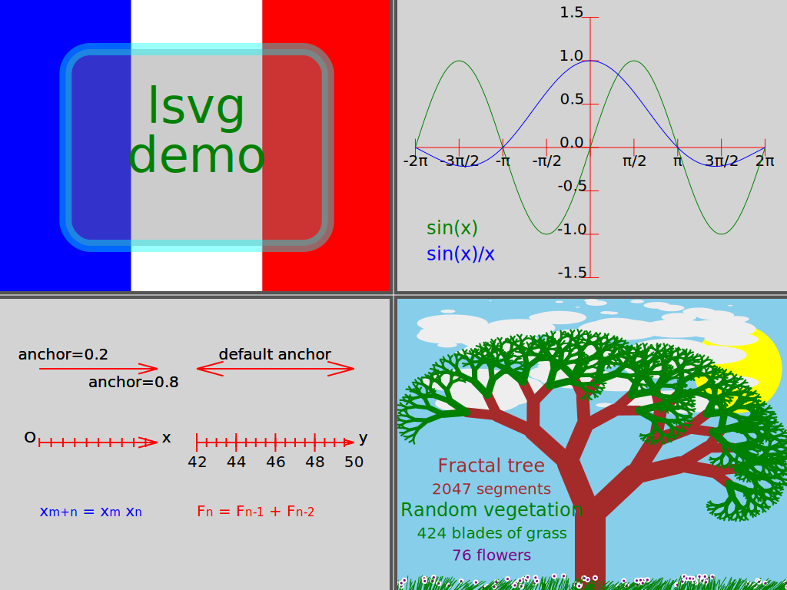

# Lua scriptable SVG image generator

`lsvg` is a Lua interpreter specialized to generate SVG images.

It is based on [LuaX](https://github.com/CDSoft/luax) and uses a pure Lua
library to generate SVG images. It optionally requires
[ImageMagick](https://imagemagick.org/) to make PNG images.

`lsvg` was initially inspired by [svg-lua](https://github.com/Jericho1060/svg-lua).

## Installation

`lsvg` is available on Github: <https://github.com/CDSoft/lsvg>.

`lsvg` uses [LuaX](https://github.com/CDSoft/luax).

```
$ git clone https://github.com/CDSoft/luax && ninja -C luax install
$ git clone https://github.com/CDSoft/lsvg
$ cd lsvg
$ ninja install
```

If LuaX is not installed yet, the first compilation may take a while...

## Precompiled LuaX binaries

In case precompiled binaries are needed (GNU/Linux, MacOS, Windows), some can
be found at [cdelord.fr/hey](http://cdelord.fr/hey). These archives contain
lsvg as well as some other softwares more or less related to LuaX.

## Usage

### Help

```
$ lsvg -h

Usage: lsvg [-h] [-v] [-o output] <input> [<input>] ...

SVG generator scriptable in LuaX

Arguments after "--" are given to the input scripts

Arguments:
   input                 Lua script using the svg module to build an SVG image

Options:
   -h, --help            Show this help message and exit.
   -v                    Print Bang version
   -o output             Output file name (SVG, PNG or PDF)
   --MF name             Set the dependency file name (implies `--MD`)
   --MD                  Generate a dependency file

For more information, see https://github.com/CDSoft/lsvg
```

### Example

```
$ lsvg demo.lua -o demo.svg -- lsvg demo
```

This command stores `{"lsvg", "demo"}` in `arg`, executes
[`demo.lua`](tests/demo.lua) and produces [`demo.svg`](tests/demo.svg):

> 

## Documentation

No documentation yet. Just read the source code...

- [lsvg.lua](lsvg.lua): main lsvg script
- [svg.lua](svg.lua): Lua SVG library
- [demo.lua](tests/demo.lua): lsvg example
- [SVG specifications](https://www.w3.org/TR/SVG12/): if you're brave enough...

## License

    lsvg is free software: you can redistribute it and/or modify
    it under the terms of the GNU General Public License as published by
    the Free Software Foundation, either version 3 of the License, or
    (at your option) any later version.

    lsvg is distributed in the hope that it will be useful,
    but WITHOUT ANY WARRANTY; without even the implied warranty of
    MERCHANTABILITY or FITNESS FOR A PARTICULAR PURPOSE.  See the
    GNU General Public License for more details.

    You should have received a copy of the GNU General Public License
    along with lsvg.  If not, see <https://www.gnu.org/licenses/>.

    For further information about lsvg you can visit
    http://cdelord.fr/lsvg
