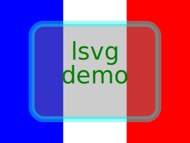

# Lua scriptable SVG image generator

`lsvg` is a Lua interpreter specialized to generate SVG images.

It is based on [LuaX](https://github.com/CDSoft/luax) and uses a pure Lua
library to generate SVG images. It optionally requires
[ImageMagick](https://imagemagick.org/) to make PNG images.

`lsvg` is inspired by [svg-lua](https://github.com/Jericho1060/svg-lua).

## Installation

`lsvg` uses [LuaX](https://github.com/CDSoft/luax) and
[makex](https://github.com/CDSoft/makex). All dependencies are installed by
make.

``` sh
$ git clone https://github.com/CDSoft/lsvg
$ cd lsvg
$ make install
```

If LuaX is not installed yet, the first compilation may take a while...

## Usage

### Help

``` sh
$ lsvg

lsvg <Lua scripts> <output files>

<Lua scripts>
    Lua script using the svg module
    to build an SVG image in a global variable (img)

<output files>
    Output file names where the image is saved
    (SVG or PNG)
```

### Example

``` sh
$ lsvg demo.lua demo.svg
```

This command execute [`demo.lua`](demo.lua) and produces
[`demo.svg`](demo.svg):



## Documentation

No documentation yet. Just read the source code...

- [lsvg.lua](lsvg.lua): main lsvg script
- [svg.lua](svg.lua): Lua SVG library
- [demo.lua](demo.lua): lsvg example
- [SVG specifications](https://www.w3.org/TR/SVG12/): if you're brave enough...

## License

    lsvg is free software: you can redistribute it and/or modify
    it under the terms of the GNU General Public License as published by
    the Free Software Foundation, either version 3 of the License, or
    (at your option) any later version.

    lsvg is distributed in the hope that it will be useful,
    but WITHOUT ANY WARRANTY; without even the implied warranty of
    MERCHANTABILITY or FITNESS FOR A PARTICULAR PURPOSE.  See the
    GNU General Public License for more details.

    You should have received a copy of the GNU General Public License
    along with lsvg.  If not, see <https://www.gnu.org/licenses/>.

    For further information about lsvg you can visit
    http://cdelord.fr/lsvg
